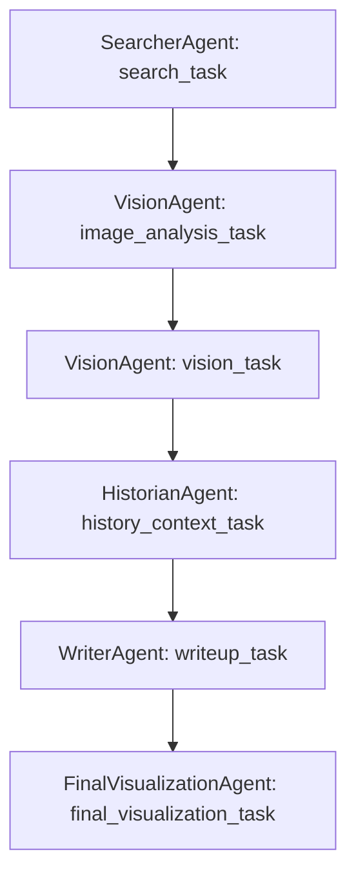

# CrewHistorian - AI-Powered Historical Research Crew

A sophisticated multi-agent AI system built with crewAI that conducts comprehensive historical research and generates visual documentation. CrewHistorian combines web search, historical analysis, and AI-generated visualizations to create complete research reports on any historical topic.

---

🌟 What CrewHistorian Does
CrewHistorian employs a team of specialized AI agents that work together to:

* Search for authentic historical visual materials and documents
* Analyze visual characteristics and artistic elements of historical periods
* Research comprehensive historical context and significance
* Synthesize findings into coherent research reports
* Generate final visualizations that capture the essence of the research

---

🏗️ Project Architecture

### Agents Overview

* **SearcherAgent**: Finds historical visual materials using optimized search queries
* **VisionAgent**: Describes visual characteristics based on historical knowledge
* **HistorianAgent**: Provides comprehensive historical context and analysis
* **WriterAgent**: Synthesizes all research into compelling narratives
* **FinalVisualizationAgent**: Creates comprehensive visual representations

### Custom Tools

* **ScrapingDogSearchTool**: Web search for historical materials
* **MistralVisionTool**: Image analysis capabilities
* **MistralImageCreationTool**: AI-powered image generation

---

🚀 Quick Start Guide

### Prerequisites

* Python: Version 3.10, 3.11, or 3.12 (crewAI does not support 3.13+ yet)
* Operating System: Windows, macOS, or Linux

### Step 1: Install Python and UV

```bash
python --version  # Should show 3.10.x, 3.11.x, or 3.12.x
pip install uv
```

### Step 2: Install CrewAI

```bash
pip install crewai
# Or using UV:
uv add crewai
```

### Step 3: Clone and Setup Project

```bash
git clone https://github.com/your-repo/crew-historian
cd crew-historian
crewai install
# Or manually:
uv install
```

### Step 4: Configure Environment Variables

```bash
cp .env.example .env
```

Make sure you add a .env file with your keys to the root.

Edit `.env` and add your API keys:

```
MISTRAL_API_KEY=your_mistral_api_key_here
SCRAPINGDOG_API_KEY=your_scrapingdog_api_key_here
SERP_API_KEY = your key
```

---

### Getting API Keys

* **Mistral AI**: [Mistral Console](https://mistral.ai)
* **ScrapingDog**: [ScrapingDog Website](https://www.scrapingdog.com)

---

### Step 5: Test Installation

```bash
python main.py test "Renaissance art"
```

Expected Output:

* Agents being created and assigned tasks
* Search results found
* Visual and historical analysis completed
* Final report and visualization created

---

📖 How to Use CrewHistorian


### Basic Usage

Sometimes in conda on mac I find I have to run
PYTHONPATH=src python src/crew_historian/main.py test "The Rise Of The Baroque Movement In Art"


```bash
python main.py run "your historical topic here"
```

Examples:

```bash
python main.py run "Ancient Egyptian pyramids"
python main.py run "1960s counterculture movement"
```

### Using CrewAI Commands

```bash
crewai run  # Runs the crew based on main.py logic
```

---

### Advanced Usage in Code

```python
from crew_historian.crew import CrewHistorian

historian = CrewHistorian()
crew = historian.crew()
results = crew.kickoff(inputs={"topic": "Victorian era fashion"})
print(results)
```

---

📁 Project Structure

```
crew-historian/
├── src/crew_historian/
│   ├── config/
│   │   ├── agents.yaml
│   │   └── tasks.yaml
│   ├── tools/
│   │   ├── scraping_dog_search_tool.py
│   │   ├── mistral_vision_tool.py
│   │   └── mistral_image_creation_tool.py
│   ├── crew.py
│   └── main.py
├── final_visualizations/
├── crew_historian.log
├── .env
├── .env.example
└── README.md
```

---

🔧 Customization Guide

### Modifying Agents

Edit `src/crew_historian/config/agents.yaml`:

```yaml
SearcherAgent:
  name: "SearcherAgent"
  role: "Historical Visual Materials Researcher"
  goal: "Find authentic historical visual materials using short, focused search queries"
```

### Modifying Tasks

Edit `src/crew_historian/config/tasks.yaml`:

```yaml
search_task:
  description: "Find historical images"
  expected_output: "Image URL"
  agent: SearcherAgent
```

### Adding New Tools

```python
from crewai.tools import BaseTool
from typing import Type
from pydantic import BaseModel

class YourCustomTool(BaseTool):
    name: str = "Tool Name"
    description: str = "What your tool does"
    args_schema: Type[BaseModel] = YourInputSchema

    def _run(self, argument: str) -> str:
        return "Tool output"
```

---

📊 Understanding the Output

1. **Console Output**

   * Real-time progress updates
   * Agent activities and task results

2. **Log Files**

   * `crew_historian.log`
   * `mistral_image_tool.log`

3. **Generated Files**

   * Images in `final_visualizations/`
   * Reports via `print()` or console output

4. **Research Flow**:



---

🛠️ Troubleshooting

| Issue                       | Fix                                       |
| --------------------------- | ----------------------------------------- |
| `MISTRAL_API_KEY not found` | Ensure `.env` exists with the correct key |
| No search results found     | Try a different topic or check your key   |
| Agent creation failed       | Check Python version and dependencies     |
| Image generation failed     | Confirm Mistral API has image rights      |

---

🔗 Resources

* [CrewAI GitHub](https://github.com/joaomdmoura/crewAI)
* [Mistral AI](https://mistral.ai/)
* [ScrapingDog](https://www.scrapingdog.com/)
* [CrewAI Discord](https://discord.gg/crewai)

---

📝 Example Research Topics

* "Ancient Roman architecture"
* "1920s Art Deco movement"
* "Medieval illuminated manuscripts"
* "Japanese woodblock printing"
* "American Civil War photography"
* "Renaissance sculpture techniques"
* "Egyptian hieroglyphic art"
* "Pre-Columbian Aztec artifacts"

---

🤝 Contributing

* Add new tools
* Improve agent prompts
* Enhance workflows
* Support more historical content types

---

📄 License

This project is open source. See `LICENSE` for details.

---

Ready to explore history with AI? Start your first research with:

```bash
python main.py run "your favorite historical topic"
```

© Preston McCauley 2025 – Agent Con 2025
